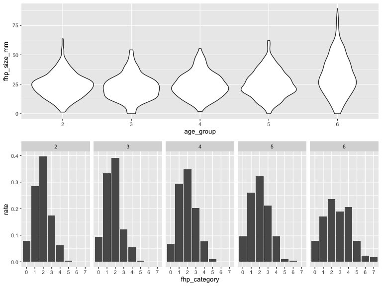

P8105 Midterm Project
================
Junxian Chen (jc5314)
10/18/2019

# Introduction:

# Problem 1

Load the R packages:

Load, clean and tidy the dataset (the raw dataset and the dataset after
cleaning were seperated so that we can go back and check the raw data
when possible mistakes were found):

``` r
raw_data = 
  read_excel("./data/p8105_mtp_data.xlsx", skip = 8)
```

``` r
mtp_data =   
  raw_data %>% 
  janitor::clean_names() %>% 
  replace_na(list(eop_size_mm = 0, eop_shape = 0)) %>% 
  mutate(
    sex = as.character(sex),
    age = as.integer(age),
    age_group = factor(age_group, levels = c('1', '2', '3', '4', '5', '6', '7', '8')),
    eop_size = factor(eop_size, levels = c('0', '1', '2', '3', '4', '5')),
    eop_visibility_classification = factor(eop_visibility_classification, levels = c('0', '1', '2')),
    eop_shape = as.character(eop_shape),
    fhp_category = factor(fhp_category, levels = c('0', '1', '2', '3', '4', '5', '6', '7'))
  )
```

``` r
mtp_data %>% 
  mutate(
    age_group = case_when(
      age_group == '1' ~ 'less than 18',
      age_group == '2' ~ '18-30',
      age_group == '3' ~ '31-40',
      age_group == '4' ~ '41-50',
      age_group == '5' ~ '51-60',
      age_group %in% c('6', '7', '8') ~ 'larger than 60'
    )
  ) %>% 
  group_by(sex, age_group) %>% 
  summarize(n = n()) %>%
  pivot_wider(
    names_from = sex,
    values_from = n
  ) %>% 
  knitr::kable(
    col.names = c('Age', 'Female', 'Male'),
  )
```

| Age            | Female | Male |
| :------------- | -----: | ---: |
| 18-30          |    151 |  152 |
| 31-40          |    102 |  102 |
| 41-50          |    106 |  101 |
| 51-60          |     99 |  101 |
| larger than 60 |    155 |  150 |
| less than 18   |      1 |    1 |

Dataset description:

Issues in the dataset:

1)  One mistake in the age group ‘1’.

<!-- end list -->

``` r
mtp_data %>% 
  ggplot(aes(x = age_group, y = age, color = age_group)) +
  geom_point() +
  geom_hline(yintercept = c(18, 31, 41, 51, 61), color = 'red', linetype = 'dotted') + 
  xlab('Age Group') +
  ylab('Age (years)') +
  scale_color_hue(name = "age group")
```


2)  
<!-- end list -->

``` r
mtp_data %>% 
  ggplot(aes(x = eop_size, y = eop_size_mm, color = eop_size)) +
  geom_point() +
  geom_hline(yintercept = c(5, 10, 15, 20, 25), color = 'red', linetype = 'dotted') + 
  xlab('EOP Size Group') +
  ylab('EOP Size (mm)') +
  scale_color_hue(name = "age group")
```


Lots of mistakes in the classification in EOP size. Also, the ‘NA’ in
the plots indicates a mistake value in EOP size grouping:

``` r
row_na = which(is.na(pull(mtp_data, eop_size)))
raw_data[row_na,] %>% 
  knitr::kable()
```

| Sex | Age | Age group | EOP size (mm) | EOP size | EOP visibility Classification | EOP Shape | FHP size (mm) | FHP Category |
| --: | --: | :-------- | ------------: | :------- | ----------------------------: | --------: | ------------: | :----------- |
|   1 |  62 | 6         |            15 | 14.6     |                             2 |         2 |          40.8 | 4            |

``` r
mtp_data %>% 
  ggplot(aes(x = eop_visibility_classification, y = eop_size_mm, color = eop_visibility_classification)) +
  geom_point() +
  geom_hline(yintercept = c(0, 1, 5), color = 'red', linetype = 'dotted') + 
  xlab('EOP Size Group') +
  ylab('EOP Size (mm)') +
  scale_color_hue(name = "EOP size group")
```


Lots of mistakes in the classification in EOP visibility.

3)  
<!-- end list -->

``` r
mtp_data %>% 
  ggplot(aes(x = fhp_category, y = fhp_size_mm, color = fhp_category)) +
  geom_point() +
  geom_hline(yintercept = c(0, 10, 20, 30, 40, 50, 60, 70), color = 'red', linetype = 'dotted') + 
  xlab('FHP Size Group') +
  ylab('FHP Size (mm)') +
  scale_color_hue(name = "FHP size group")
```


``` r
row_na = which(is.na(pull(mtp_data, fhp_category)))
raw_data[row_na,] %>% 
  knitr::kable()
```

| Sex | Age | Age group | EOP size (mm) | EOP size | EOP visibility Classification | EOP Shape | FHP size (mm) | FHP Category |
| --: | --: | :-------- | ------------: | :------- | ----------------------------: | --------: | ------------: | :----------- |
|   0 |  51 | 5         |            NA | 0        |                             0 |        NA |          30.3 | 30.8         |

# Problem 2

``` r
plot_df = 
  mtp_data %>% 
  mutate(
    age_group = factor(age_group, labels = c('1', '2', '3', '4', '5', '6', '6', '6')),
    droplevels(age_group)) %>% 
  filter(age_group != '1')
```

``` r
fhp_plot =
  plot_df %>% 
  drop_na(fhp_size_mm) %>% 
  ggplot(aes(x = age_group, y = fhp_size_mm, fill = sex)) +
  geom_boxplot() +
  stat_summary(
    fun.y = mean, aes(colour = "Mean"), 
    geom = "point", 
    shape = 18, 
    size = 3,
    position = position_dodge(width = 0.75)) +
  stat_summary(
    fun.data = mean_se, 
    geom = "errorbar",
    width = 0.08,
    position = position_dodge(width = 0.75)) +
  scale_fill_hue(
    name = "Sex", 
    labels = c("Females", "Males")) +
  scale_colour_manual(
    values = c("Mean" = "darkred"), 
    labs(colour = '')) +
  xlab('Age Group (years)') +
  ylab('FHP Size (mm)') +
  scale_x_discrete(
    labels = c("18-29 years","30's", "40's", "50's", ">60's"))
```

``` r
eeop_plot = 
 plot_df %>% 
  mutate(
    eeop = case_when(
      eop_size_mm > 10 ~ 'y',
      eop_size_mm <= 10 ~ 'n'
    )
  ) %>% 
  group_by(age_group, sex) %>% 
  count(eeop) %>%
  mutate(rate = prop.table(n)) %>% 
  filter(eeop == 'y') %>% 
  ggplot(aes(y = rate, x = age_group)) +
  geom_line(aes(group = sex, color = sex)) +
  geom_point() +
  scale_color_hue(
    name = "Sex", 
    labels = c("Females", "Males")) +
  xlab('Age Group (years)') +
  ylab('EEOP Rate (%)') +
  scale_x_discrete(
    labels = c("18-29 years","30's", "40's", "50's", ">60's"))
```

``` r
# create a two-panel figure and show the plot

fhp_plot / eeop_plot
```


``` r
fhp_eop_plot = 
  plot_df %>% 
  drop_na(fhp_size_mm) %>% 
  filter(eop_size_mm != 0) %>% 
  ggplot(aes(x = fhp_size_mm, y = eop_size_mm, color = sex)) +
  geom_point() +
  geom_smooth(
    method = "lm", 
    color = 'black',
    se = FALSE) +
  facet_grid(
    sex ~ age_group, 
    labeller = as_labeller(c('0' = 'Female', '1' = 'Male', '2' = '18-29 years', 
                             '3' = "30's", '4' = "40's", '5' = "50's", '6' = ">60's"))) +
  xlab('FHP Size (mm)') +
  ylab('EOP Size (mm)') +
  scale_color_hue(
    name = "Sex", 
    labels = c("Females", "Males"))

# show the plot

fhp_eop_plot
```


# Problem 3

Are the authors’ stated sample sizes in each age group consistent with
the data you have available? Ans:No.

``` r
mtp_data %>% 
  group_by(age_group) %>% 
  summarize(n = n()) %>% 
  knitr::kable()
```

| age\_group |   n |
| :--------- | --: |
| 1          |   2 |
| 2          | 303 |
| 3          | 204 |
| 4          | 207 |
| 5          | 200 |
| 6          | 178 |
| 7          | 126 |
| 8          |   1 |

``` r
mtp_data %>% 
  nrow()
```

    ## [1] 1221

Are the reported mean and standard deviations for FHP size consistent
with the data you have available? Ans:Yes.

``` r
mean(pull(mtp_data, fhp_size_mm), na.rm = TRUE)
```

    ## [1] 26.10134

``` r
mtp_data %>% 
  group_by(sex) %>% 
  summarize(
    maen = mean(fhp_size_mm, na.rm = TRUE), 
    sd = sd(fhp_size_mm, na.rm = TRUE))
```

    ## # A tibble: 2 x 3
    ##   sex    maen    sd
    ##   <chr> <dbl> <dbl>
    ## 1 0      23.7  10.6
    ## 2 1      28.5  14.7

The authors find “the prevalence of EEOP to be 33% of the study
population”. What is the definition of EEOP, and what variables can you
use to evaluate this claim? Is the finding consistent with the data
available to you?

Ans: Those bony outgrowths were named enlarged EOP (EEOP) only when they
have exceeded 10 mm in size, use variable eop\_size\_mm. Yes.(1%
difference)

``` r
mtp_data %>% 
  mutate(
    eeop = case_when(
      eop_size_mm > 10 ~ 'y',
      eop_size_mm <= 10 ~ 'n'
    )
  ) %>% 
  count(eeop) %>%
  mutate(rate = prop.table(n))
```

    ## # A tibble: 2 x 3
    ##   eeop      n  rate
    ##   <chr> <int> <dbl>
    ## 1 n       829 0.679
    ## 2 y       392 0.321

FHP is noted to be more common in older subjects, with “FHP \>40 mm
observed frequently (34.5%) in the over 60s cases”. Are the broad trends
and specific values consistent with your data? Ans: Yes. No.

``` r
p1 = 
plot_df %>% 
  drop_na(fhp_category) %>% 
  ggplot(aes(x = age_group, y = fhp_size_mm)) +
  geom_violin()
  
p2 = 
plot_df %>% 
  drop_na(fhp_category) %>% 
  group_by(age_group) %>% 
  count(fhp_category) %>% 
  mutate(rate = prop.table(n)) %>%  
  ggplot(aes(x = fhp_category, y = rate)) +
  geom_col() +
  facet_grid(~age_group)

p1 / p2
```



``` r
plot_df %>% 
  group_by(age_group) %>% 
  count(fhp_category) %>% 
  mutate(rate = prop.table(n)) %>%
  filter(age_group == '6' & fhp_category %in% c('4', '5', '6', '7')) %>% 
  summarize(sum = sum(rate))
```

    ## # A tibble: 1 x 2
    ##   age_group   sum
    ##   <fct>     <dbl>
    ## 1 6         0.325

# Problem 4

Summarize your results, the quality of the data analysis / presentation
of results in the original report, and comment on the conclusions of the
reports’ authors. Do you think the data provide evidence that cell
phones are causing horn growth? What other data would you like to have
to address this hypothesis?

# Problem 4
