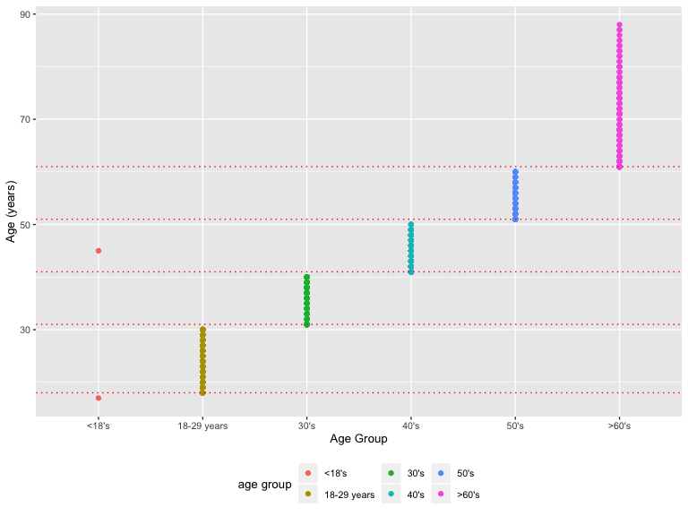

P8105 Midterm Project
================
Junxian Chen (jc5314)
10/18/2019

## Introduction:

An article was published on Nature Scientific Reports in 2018 which
describing relationship between forward head protraction (FHP) and
enlarged external occipital protuberance (EEOP). The researchers
analyzed data from people with different ages and sex, and pointed out
that the prominent exostosis were more substantial and prevalent in
young adults than older groups. However, people were skeptical about
this study and a published author correction indicated that errors or
defects existed in the original work. In this project, the data that
accompany the author correction from this study are used to test if
mistakes are still exist and to exam whether the results are consistent
with that reported in the article.

## Section 1: Dataset

### 1.1 Dataset Description

``` r
raw_data = 
  read_excel("./data/p8105_mtp_data.xlsx", skip = 8)
```

``` r
mtp_data =   
  raw_data %>% 
  janitor::clean_names() %>% 
  replace_na(list(eop_size_mm = 0, eop_shape = 0)) %>% 
  mutate(
    sex = as.character(sex),
    age = as.integer(age),
    age_group = case_when(
      age_group  %in% c('6', '7', '8') ~ '6+', 
      TRUE ~ age_group ),
    age_group = factor(age_group, levels = c('1', '2', '3', '4', '5', '6+')),
    eop_size = factor(eop_size, levels = c('0', '1', '2', '3', '4', '5')),
    eop_visibility_classification = factor(eop_visibility_classification, levels = c('0', '1', '2')),
    eop_shape = as.character(eop_shape),
    fhp_category = factor(fhp_category, levels = c('0', '1', '2', '3', '4', '5', '6', '7'))
  )

str(mtp_data)
```

    ## Classes 'tbl_df', 'tbl' and 'data.frame':    1221 obs. of  9 variables:
    ##  $ sex                          : chr  "1" "1" "0" "1" ...
    ##  $ age                          : int  18 26 22 20 27 28 17 21 25 30 ...
    ##  $ age_group                    : Factor w/ 6 levels "1","2","3","4",..: 2 2 2 2 2 2 1 2 2 2 ...
    ##  $ eop_size_mm                  : num  14.8 17.1 0 23.9 0 7.9 6.4 9.4 0 16.5 ...
    ##  $ eop_size                     : Factor w/ 6 levels "0","1","2","3",..: 3 4 1 5 1 2 2 2 1 4 ...
    ##  $ eop_visibility_classification: Factor w/ 3 levels "0","1","2": 3 3 2 3 1 3 3 3 1 3 ...
    ##  $ eop_shape                    : chr  "3" "3" "0" "1" ...
    ##  $ fhp_size_mm                  : num  34.7 32.9 28.1 11 19.3 27.6 30.6 27.8 26.2 21 ...
    ##  $ fhp_category                 : Factor w/ 8 levels "0","1","2","3",..: 4 4 3 2 2 3 4 3 3 3 ...

The raw dataset was imported and cleaned. (Because the raw dataset would
be used later to illustrate mistakes, the process of importing and
cleaning were seperated here). In the data cleaning, missing values were
filled according to the header information, variable types were
modified, and orders were given to the factor variables. Since the
article used all individuls older than 60 as a whole ‘\>60’ group, those
people were all assigned as ‘6+’ under the `age_group` variables here to
facilitate furthur analyses.

After data cleaning, the resulting dataset, named `mtp_data`, contains
1221 observations (i.e. the number of participants) and 9 variables.

``` r
mtp_data %>% 
  mutate(
    age_group = case_when(
      age_group == '1' ~ 'less than 18',
      age_group == '2' ~ '18-30',
      age_group == '3' ~ '31-40',
      age_group == '4' ~ '41-50',
      age_group == '5' ~ '51-60',
      age_group == '6+' ~ 'larger than 60'
    )
  ) %>% 
  group_by(sex, age_group) %>% 
  summarize(n = n()) %>%
  pivot_wider(
    names_from = sex,
    values_from = n
  ) %>% 
  knitr::kable(
    col.names = c('Age', 'Female', 'Male'),
  )
```

| Age            | Female | Male |
| :------------- | -----: | ---: |
| 18-30          |    151 |  152 |
| 31-40          |    102 |  102 |
| 41-50          |    106 |  101 |
| 51-60          |     99 |  101 |
| larger than 60 |    155 |  150 |
| less than 18   |      1 |    1 |

### 1.2 Issues Noticed in Dataset:

1)  One mistake in the age group ‘1’.

<!-- end list -->

``` r
mtp_data %>% 
  ggplot(aes(x = age_group, y = age, color = age_group)) +
  geom_point() +
  geom_hline(yintercept = c(18, 31, 41, 51, 61), color = 'red', linetype = 'dotted') + 
  xlab('Age Group') +
  ylab('Age (years)') +
  scale_color_hue(name = "age group") +
  scale_x_discrete(
    labels = c("<18's", "18-29 years","30's", "40's", "50's", ">60's")) +
  scale_color_hue(name = "age group",
                  labels = c("<18's", "18-29 years","30's", "40's", "50's", ">60's"))
```

    ## Scale for 'colour' is already present. Adding another scale for
    ## 'colour', which will replace the existing scale.



2)  
<!-- end list -->

``` r
mtp_data %>% 
  ggplot(aes(x = eop_size, y = eop_size_mm, color = eop_size)) +
  geom_point() +
  geom_hline(yintercept = c(5, 10, 15, 20, 25), color = 'red', linetype = 'dotted') + 
  xlab('EOP Size Group') +
  ylab('EOP Size (mm)') +
  scale_color_hue(name = "eop size group")
```


Lots of mistakes in the classification in EOP size. Also, the ‘NA’ in
the plots indicates a mistake value in EOP size grouping:

``` r
row_na = which(is.na(pull(mtp_data, eop_size)))
raw_data[row_na,] %>% 
  knitr::kable()
```

| Sex | Age | Age group | EOP size (mm) | EOP size | EOP visibility Classification | EOP Shape | FHP size (mm) | FHP Category |
| --: | --: | :-------- | ------------: | :------- | ----------------------------: | --------: | ------------: | :----------- |
|   1 |  62 | 6         |            15 | 14.6     |                             2 |         2 |          40.8 | 4            |

``` r
mtp_data %>% 
  ggplot(aes(x = eop_visibility_classification, y = eop_size_mm, color = eop_visibility_classification)) +
  geom_point() +
  geom_hline(yintercept = c(0, 1, 5), color = 'red', linetype = 'dotted') + 
  xlab('EOP Size Group') +
  ylab('EOP Size (mm)') +
  scale_color_hue(name = "EOP size group")
```


Lots of mistakes in the classification in EOP visibility.

3)  
<!-- end list -->

``` r
mtp_data %>% 
  ggplot(aes(x = fhp_category, y = fhp_size_mm, color = fhp_category)) +
  geom_point() +
  geom_hline(yintercept = c(0, 10, 20, 30, 40, 50, 60, 70), color = 'red', linetype = 'dotted') + 
  xlab('FHP Size Group') +
  ylab('FHP Size (mm)') +
  scale_color_hue(name = "FHP size group")
```


``` r
row_na = which(is.na(pull(mtp_data, fhp_category)))
raw_data[row_na,] %>% 
  knitr::kable()
```

| Sex | Age | Age group | EOP size (mm) | EOP size | EOP visibility Classification | EOP Shape | FHP size (mm) | FHP Category |
| --: | --: | :-------- | ------------: | :------- | ----------------------------: | --------: | ------------: | :----------- |
|   0 |  51 | 5         |            NA | 0        |                             0 |        NA |          30.3 | 30.8         |

## Section 2: Visualization Improvement

``` r
fhp_plot =
  mtp_data %>% 
  filter(age_group != '1') %>% 
  drop_na(fhp_size_mm) %>% 
  ggplot(aes(x = age_group, y = fhp_size_mm, fill = sex)) +
  geom_boxplot() +
  stat_summary(
    fun.y = mean, aes(colour = "Mean"), 
    geom = "point", 
    shape = 18, 
    size = 3,
    position = position_dodge(width = 0.75)) +
  stat_summary(
    fun.data = mean_se, 
    geom = "errorbar",
    width = 0.08,
    position = position_dodge(width = 0.75)) +
  scale_fill_hue(
    name = "Sex", 
    labels = c("Females", "Males")) +
  scale_colour_manual(
    values = c("Mean" = "darkred"), 
    labs(colour = '')) +
  xlab('Age Group (years)') +
  ylab('FHP Size (mm)') +
  scale_x_discrete(
    labels = c("18-29 years","30's", "40's", "50's", ">60's"))
```

``` r
eeop_plot = 
  mtp_data %>% 
  filter(age_group != '1') %>% 
  mutate(
    eeop = case_when(
      eop_size_mm > 10 ~ 'y',
      eop_size_mm <= 10 ~ 'n'
    )
  ) %>% 
  group_by(age_group, sex) %>% 
  count(eeop) %>%
  mutate(rate = prop.table(n)) %>% 
  filter(eeop == 'y') %>% 
  ggplot(aes(y = rate, x = age_group)) +
  geom_line(aes(group = sex, color = sex)) +
  geom_point() +
  scale_color_hue(
    name = "Sex", 
    labels = c("Females", "Males")) +
  xlab('Age Group (years)') +
  ylab('EEOP Rate (%)') +
  scale_x_discrete(
    labels = c("18-29 years","30's", "40's", "50's", ">60's"))
```

``` r
# create a two-panel figure and show the plot

fhp_plot / eeop_plot
```


``` r
fhp_eop_plot = 
  mtp_data %>% 
  filter(age_group != '1') %>% 
  drop_na(fhp_size_mm) %>% 
  filter(eop_size_mm != 0) %>% 
  ggplot(aes(x = fhp_size_mm, y = eop_size_mm, color = sex)) +
  geom_point() +
  geom_smooth(
    method = "lm", 
    color = 'black',
    se = FALSE) +
  facet_grid(
    sex ~ age_group, 
    labeller = as_labeller(c('0' = 'Female', '1' = 'Male', '2' = '18-29 years', 
                             '3' = "30's", '4' = "40's", '5' = "50's", '6' = ">60's"))) +
  xlab('FHP Size (mm)') +
  ylab('EOP Size (mm)') +
  scale_color_hue(
    name = "Sex", 
    labels = c("Females", "Males"))

# show the plot

fhp_eop_plot
```


## Section 3: Reproducing reported results

Are the authors’ stated sample sizes in each age group consistent with
the data you have available? Ans:No.

``` r
mtp_data %>% 
  group_by(age_group) %>% 
  summarize(n = n()) %>% 
  knitr::kable()
```

| age\_group |   n |
| :--------- | --: |
| 1          |   2 |
| 2          | 303 |
| 3          | 204 |
| 4          | 207 |
| 5          | 200 |
| 6+         | 305 |

``` r
mtp_data %>% 
  nrow()
```

    ## [1] 1221

Are the reported mean and standard deviations for FHP size consistent
with the data you have available? Ans:Yes.

``` r
mean(pull(mtp_data, fhp_size_mm), na.rm = TRUE)
```

    ## [1] 26.10134

``` r
mtp_data %>% 
  group_by(sex) %>% 
  summarize(
    maen = mean(fhp_size_mm, na.rm = TRUE), 
    sd = sd(fhp_size_mm, na.rm = TRUE))
```

    ## # A tibble: 2 x 3
    ##   sex    maen    sd
    ##   <chr> <dbl> <dbl>
    ## 1 0      23.7  10.6
    ## 2 1      28.5  14.7

The authors find “the prevalence of EEOP to be 33% of the study
population”. What is the definition of EEOP, and what variables can you
use to evaluate this claim? Is the finding consistent with the data
available to you?

Ans: Those bony outgrowths were named enlarged EOP (EEOP) only when they
have exceeded 10 mm in size, use variable eop\_size\_mm. Yes.(1%
difference)

``` r
mtp_data %>% 
  mutate(
    eeop = case_when(
      eop_size_mm > 10 ~ 'y',
      eop_size_mm <= 10 ~ 'n'
    )
  ) %>% 
  count(eeop) %>%
  mutate(rate = prop.table(n))
```

    ## # A tibble: 2 x 3
    ##   eeop      n  rate
    ##   <chr> <int> <dbl>
    ## 1 n       829 0.679
    ## 2 y       392 0.321

FHP is noted to be more common in older subjects, with “FHP \>40 mm
observed frequently (34.5%) in the over 60s cases”. Are the broad trends
and specific values consistent with your data? Ans: Yes. No.

``` r
p1 = 
  mtp_data %>% 
  filter(age_group != '1') %>% 
  drop_na(fhp_category) %>% 
  ggplot(aes(x = age_group, y = fhp_size_mm)) +
  geom_violin() +
  xlab('Age Group') +
  ylab('FHP Size (mm)') +
  scale_x_discrete(
    labels = c("18-29 years","30's", "40's", "50's", ">60's"))
  
p2 = 
  mtp_data %>% 
  filter(age_group != '1') %>% 
  drop_na(fhp_category) %>% 
  group_by(age_group) %>% 
  count(fhp_category) %>% 
  mutate(rate = prop.table(n)) %>%  
  ggplot(aes(x = fhp_category, y = rate)) +
  geom_col() +
  xlab('FHP Categroy') +
  ylab('Rate') +
  facet_grid(~age_group) 

p1 / p2
```


``` r
mtp_data %>% 
  filter(age_group != '1') %>% 
  drop_na(fhp_category) %>% 
  group_by(age_group) %>% 
  count(fhp_category) %>% 
  mutate(rate = prop.table(n)) %>%
  filter(age_group == '6+' & fhp_category %in% c('4', '5', '6', '7')) %>% 
  summarize(sum = sum(rate))
```

    ## # A tibble: 1 x 2
    ##   age_group   sum
    ##   <fct>     <dbl>
    ## 1 6+        0.325

## Section 4: Summary and Discussions

Summarize your results, the quality of the data analysis / presentation
of results in the original report, and comment on the conclusions of the
reports’ authors. Do you think the data provide evidence that cell
phones are causing horn growth? What other data would you like to have
to address this hypothesis?
